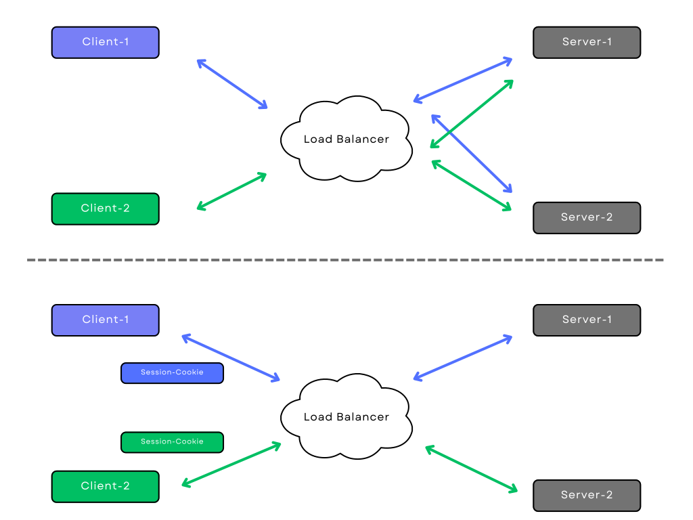

# Sticky-Sessions

## I. Einführung

Sticky Sessions sind eine Funktion, die häufig in Load Balancern zu finden ist und es einer Webanwendung ermöglicht, Benutzereinstellungen zu speichern, Benutzer authentifiziert zu halten usw. Bei Sticky Sessions kann der Load Balancer Anfragen eines bestimmten Clients identifizieren und diese immer an denselben Server weiterleiten. Bei Sticky Sessions werden alle Benutzerinformationen serverseitig gespeichert, und diese Methode wird häufig bei zustandsbehafteten Diensten verwendet.

Quelle: <https://traefik.io/glossary/what-are-sticky-sessions/>

### Zweck der Verwendung von Sticky-Sessions in Webanwendungen

Der Zweck der Verwendung von Sticky-Sessions in Webanwendungen besteht darin, die Konsistenz und Kontinuität der Benutzersitzungen sicherzustellen. Durch das Weiterleiten von Anfragen desselben Clients an denselben Server können Webanwendungen Benutzerpräferenzen, Authentifizierungsstatus und andere zustandsbezogene Informationen beibehalten. Dies ermöglicht eine nahtlose Benutzererfahrung, da Benutzer ihre Sitzungsinformationen nicht bei jedem Serverwechsel erneut eingeben müssen. Sticky-Sessions sind besonders wichtig für Anwendungen, die Benutzerdaten und Zustände speichern müssen, um eine personalisierte Interaktion zu ermöglichen.

Quelle: <https://traefik.io/glossary/what-are-sticky-sessions/>

## II. Funktionsweise von Sticky-Sessions

Die Funktionsweise von Sticky-Sessions besteht darin, sicherzustellen, dass Anfragen eines bestimmten Clients immer an denselben Server weitergeleitet werden. Dadurch können die Sitzungsinformationen des Benutzers beibehalten werden.

**1. Client-Anfrage**: Ein Client stellt eine Anfrage an den Load Balancer, der als Vermittler zwischen dem Client und den Servern fungiert.

**2. Load-Balancing-Entscheidung**: Der Load Balancer entscheidet, an welchen Server die Anfrage weitergeleitet wird. Bei Verwendung von Sticky-Sessions berücksichtigt der Load Balancer das Session-Cookie, das der Client bei vorherigen Anfragen erhalten hat.

**3. Überprüfung des Session-Cookies**: Der Load Balancer überprüft das Session-Cookie in der Anfrage des Clients. Das Session-Cookie enthält eine eindeutige Kennung, die den Client identifiziert.

**4. Weiterleitung an den entsprechenden Server**: Basierend auf dem Session-Cookie leitet der Load Balancer die Anfrage an den Server weiter, der mit dem identifizierten Client verknüpft ist. Dadurch wird sichergestellt, dass alle zukünftigen Anfragen desselben Clients an denselben Server gesendet werden.

**5. Beibehaltung der Sitzungsinformationen**: Da alle Anfragen desselben Clients an denselben Server gesendet werden, kann der Server die Sitzungsinformationen beibehalten. Dies ermöglicht beispielsweise die Aufrechterhaltung der Benutzeranmeldung oder das Speichern von benutzerspezifischen Einstellungen.

Quelle: <https://www.haproxy.com/de/blog/load-balancing-affinity-persistence-sticky-sessions-what-you-need-to-know/>

### Visualisierung der Funktionsweise

## III. Probleme bei Skalierung und Sticky-Sessions

Das Problem bei der Skalierung von Anwendungen mit Sticky-Sessions besteht darin, dass sie die Lastenausgleichsfunktion beeinträchtigen können. Die Persistenz der Sitzungsinformationen führt zu einer ungleichmäßigen Verteilung der Last auf die Server, was die Skalierbarkeit der Anwendung beeinträchtigt. Darüber hinaus können die Ressourcenanforderungen durch die Speicherung der Sitzungsinformationen auf den Servern ansteigen.

Single-Page-Anwendungen können dabei helfen, diese Skalierungsprobleme zu bewältigen. Da Single-Page-Anwendungen auf der Client-Seite ausgeführt werden, sind sie in der Regel zustandslos (stateless). Das bedeutet, dass alle erforderlichen Daten für die Ausführung der Anwendung auf dem Client gespeichert werden und nicht auf dem Server. Daher ist es nicht notwendig, Sitzungsinformationen zwischen verschiedenen Servern zu synchronisieren oder zu persistieren.

Durch die Verwendung einer Single-Page-Anwendung wird die Notwendigkeit von Sticky-Sessions verringert oder eliminiert. Jeder Server kann Anfragen unabhängig voneinander bearbeiten, da der Zustand auf dem Client gespeichert wird. Dadurch wird eine bessere Lastenverteilung und Skalierbarkeit erreicht.

Quelle: <https://traefik.io/glossary/what-are-sticky-sessions/>
