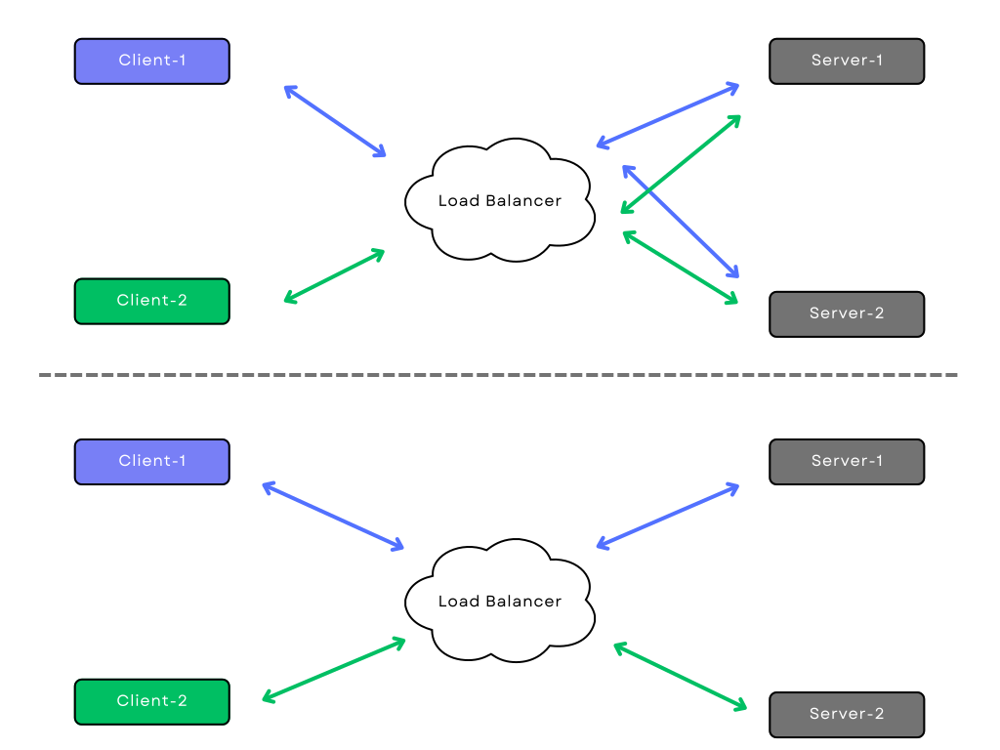

# Sticky-Sessions

## I. Einführung

Sticky Sessions (auch als Session Persistence bezeichnet) sind eine Funktion, die häufig in Load Balancern zu finden ist und es einer Webanwendung ermöglicht, Benutzereinstellungen zu speichern, Benutzer authentifiziert zu halten usw. Bei Sticky Sessions kann der Load Balancer Anfragen eines bestimmten Clients identifizieren und diese immer an denselben Server weiterleiten. Bei Sticky Sessions werden alle Benutzerinformationen serverseitig gespeichert, und diese Methode wird häufig bei zustandsbehafteten Diensten verwendet.

Quelle: <https://traefik.io/glossary/what-are-sticky-sessions/>

### A. Zweck der Verwendung von Sticky-Sessions in Webanwendungen

Der Zweck der Verwendung von Sticky-Sessions in Webanwendungen besteht darin, die Konsistenz und Kontinuität der Benutzersitzungen sicherzustellen. Durch das Weiterleiten von Anfragen desselben Clients an denselben Server können Webanwendungen Benutzerpräferenzen, Authentifizierungsstatus und andere zustandsbezogene Informationen beibehalten. Dies ermöglicht eine nahtlose Benutzererfahrung, da Benutzer ihre Sitzungsinformationen nicht bei jedem Serverwechsel erneut eingeben müssen. Sticky-Sessions sind besonders wichtig für Anwendungen, die Benutzerdaten und Zustände speichern müssen, um eine personalisierte Interaktion zu ermöglichen.

Quelle: <https://traefik.io/glossary/what-are-sticky-sessions/>

## II. Funktionsweise von Sticky-Sessions

Die Funktionsweise von Sticky-Sessions besteht darin, sicherzustellen, dass Anfragen eines bestimmten Clients immer an denselben Server weitergeleitet werden. Dadurch können die Sitzungsinformationen des Benutzers beibehalten werden.

**1. Client-Anfrage**: Ein Client stellt eine Anfrage an den Load Balancer, der als Vermittler zwischen dem Client und den Servern fungiert.

**2. Load-Balancing-Entscheidung**: Der Load Balancer entscheidet, an welchen Server die Anfrage weitergeleitet wird. Bei Verwendung von Sticky-Sessions berücksichtigt der Load Balancer das Session-Cookie, das der Client bei vorherigen Anfragen erhalten hat.

**3. Überprüfung des Session-Cookies**: Der Load Balancer überprüft das Session-Cookie in der Anfrage des Clients. Das Session-Cookie enthält eine eindeutige Kennung, die den Client identifiziert.

**4. Weiterleitung an den entsprechenden Server**: Basierend auf dem Session-Cookie leitet der Load Balancer die Anfrage an den Server weiter, der mit dem identifizierten Client verknüpft ist. Dadurch wird sichergestellt, dass alle zukünftigen Anfragen desselben Clients an denselben Server gesendet werden.

**5. Beibehaltung der Sitzungsinformationen**: Da alle Anfragen desselben Clients an denselben Server gesendet werden, kann der Server die Sitzungsinformationen beibehalten. Dies ermöglicht beispielsweise die Aufrechterhaltung der Benutzeranmeldung oder das Speichern von benutzerspezifischen Einstellungen.

Quelle: <https://avinetworks.com/glossary/session-persistence/>

### Visualisierung der Funktionsweise

## III. Probleme bei Skalierung und Sticky-Sessions

Bei der Skalierung von Webanwendungen können Probleme auftreten, wenn Sticky-Sessions verwendet werden. Eine Herausforderung besteht darin, dass die Verwendung von Sticky-Sessions zu einer ungleichmäßigen Verteilung der Last auf die Server führen kann. Wenn Anfragen desselben Clients immer an denselben Server gesendet werden, kann dies zu einer Überlastung bestimmter Server führen, während andere unausgelastet bleiben.

Darüber hinaus kann die Verwendung von Sticky-Sessions die Ressourcennutzung beeinflussen. Da die Sitzungsinformationen auf dem Server gespeichert werden müssen, erfordert dies zusätzlichen Speicherplatz und Verwaltungsaufwand.

### A. Herausforderungen bei der Skalierung von Anwendungen mit Sticky-Sessions

Bei der Skalierung von Anwendungen mit Sticky-Sessions treten einige Herausforderungen auf. Eine Hauptherausforderung besteht darin, dass die Verwendung von Sticky-Sessions die Lastenausgleichsfunktion beeinträchtigen kann. Da Anfragen desselben Clients immer an denselben Server weitergeleitet werden, kann dies zu einer ungleichmäßigen Verteilung der Last führen, wenn bestimmte Server stärker belastet sind als andere.

Darüber hinaus kann die Speicherung von Sitzungsinformationen auf dem Server zu einer erhöhten Ressourcennutzung führen. Da jeder Server die Sitzungsdaten für seine zugewiesenen Clients speichern muss, können die Speicheranforderungen und der Speicherbedarf insgesamt zunehmen.

Diese Herausforderungen können die Skalierbarkeit einer Anwendung beeinträchtigen, da die Verteilung der Last und die effiziente Ressourcennutzung erschwert werden.
